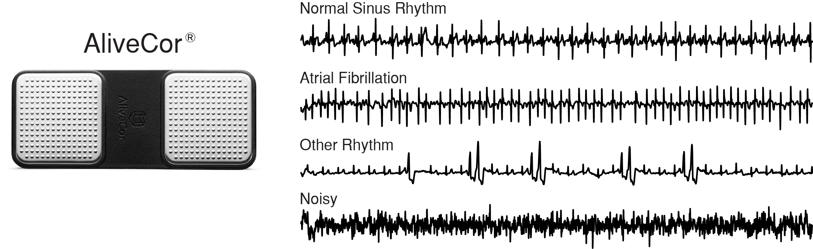
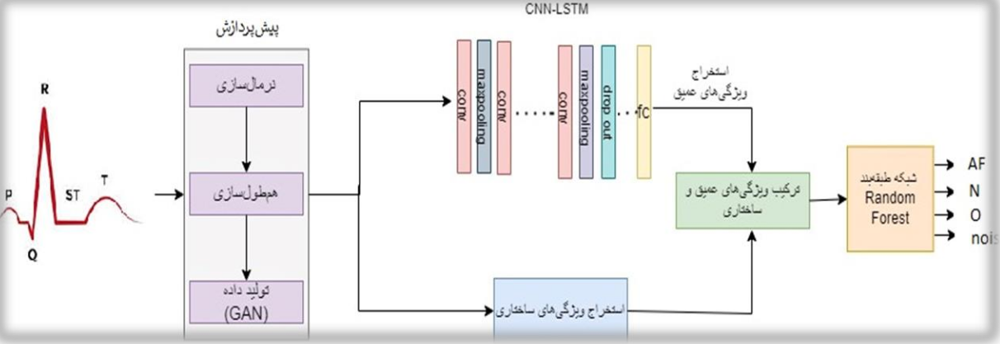

# Master's Thesis: Developing a Model to Detect Heart Arrhythmia Using Machine Learning Algorithms

## Overview
This repository contains my master's thesis work completed at Amirkabir University of Technology (Tehran Polytechnic), Tehran, Iran. The thesis focuses on developing a machine learning model to accurately detect heart arrhythmias from ECG waveforms.

## Dataset
The work utilizes the dataset from the 2017 Physionet Challenge, aimed at classifying single-lead ECG waveforms into one of four categories: Normal Sinus Rhythm, Atrial Fibrillation, Other Rhythm, or Noisy. The dataset comprises 12,186 ECG waveforms donated by AliveCor and represents data acquired across three generations of AliveCor's single-channel ECG devices. The recordings vary in length from 9 to 61 seconds, with an average duration of 30 seconds.

### Dataset Details:
- **Source:** 2017 Physionet Challenge
- **Contributor:** AliveCor
- **Number of Waveforms:** 12,186
- **Duration:** 9 to 61 seconds (average 30 seconds)

For more details and to download the dataset, visit [Physionet Challenge 2017](https://www.physionet.org/content/challenge-2017/1.0.0/training2017.zip).

### Sample Waveforms

## Model Architecture
To address the challenge, we developed a comprehensive machine learning model tailored to analyze ECG waveforms effectively. The model's architecture is designed to capture the intricate patterns associated with different types of heart rhythms.

For a detailed explanation of the model architecture and the methodologies employed, please refer to the `model_architecture.md` file in this repository.

## Acknowledgments
I would like to express my deepest gratitude to my professors, Dr. Abbas Ahmadi and Dr. Majid Amin Nayeri, for their invaluable guidance, support, and insights throughout the course of this research.

Special thanks to the GitHub repository [`ecg-features`](https://github.com/Seb-Good/ecg-features) for providing the code for feature extraction, which played a pivotal role in the development of the machine learning model for detecting heart arrhythmia.

